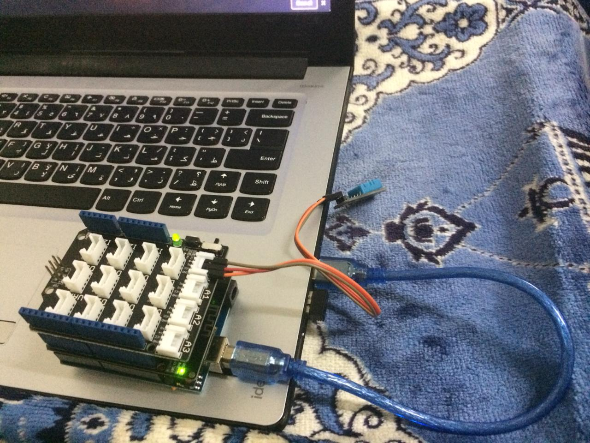

# HumTmp Arduino Website
Simple page and/or python code shows the values of Arduino humidity and temperature sensors received via UDP 

## Arduino Components

- [Temperature & Humidity Sensor](http://wiki.seeedstudio.com/Grove-Temperature_and_Humidity_Sensor_Pro/)
- [Wifi Shield](http://wiki.seeedstudio.com/Wifi_Shield_V2.0/)
- [UNO Board](https://www.seeedstudio.com/arduino-uno-c-990.html)

## Usage 
You can run one of the following to receive UDP packets
- Run python version
1. Run Arduino code
2. Run `python UDP_receiver.py` in terminal.

- Run website version
1. Run Arduino code
2. Make `HumTmp Website` current working dir. 
3. Run `nodemon start` in `Node js` terminal.
4. Open `http://localhost:2000` in browser.  
